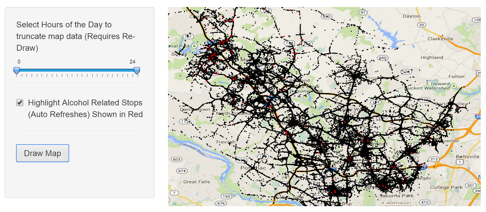

## The application
1. The application is hosted at: http://erowe.shinyapps.io/MoCo

2. This application displays traffic stops in the Montgomery County Maryland area over the last two years

3. The user has the ability to truncate the dataset to display where traffic stops occurred during fixed hours of the day and if they were alcohol related

---
## Why use this application?
1. Maybe you want to compare this to other open data projects

2. It stimulates your mind to wonder why certain areas have a higher concentration of activity

3. Maybe you want to convince your friend / co-worker / child not to stay out late

4. It might make you a more cautious driver while traveling in the area
