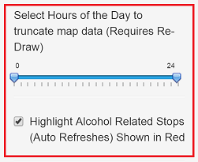
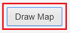

## The application
1. The application is hosted at: https://erowe.shinyapps.io/MoCoTraffiicPlotter

2. This application displays traffic stops in the Montgomery County Maryland area over the last two years

3. The user has the ability to truncate the dataset to display where traffic stops occurred during fixed hours of the day and if they were alcohol related

---
## Using the application
- To adjust the hours of the day that stops occurred, move the slider to the appropriate start and end times. To view all hours of the day, set the values to 0 and 24

- To view stops related to alcohol, click', <i>Highlight Alcohol Related Stops</i>

- The <i>Draw Map</i> button will create the map

